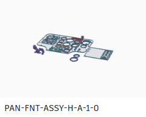

# simulator.diy
creating cool flight simulator hardware – open source – basic skills and tools – affordable

## Sources

### Aluminium and Wood parts

#### Frame

##### static

##### motion (optional)

##### OH-6A panels (optional)

#### Helicopter and fixed-wing seat

##### Seat slider (optional)

### 3D printed parts

#### Basic flight controls

#### OH-6A flight controls (optional)

#### OH-6A panel knobs (optional)

### Laser cut parts

#### OH-6A panel (optional)

### Simulator.diy shop and affiliate links

## Tools and skills

### Basic

### Recommended
